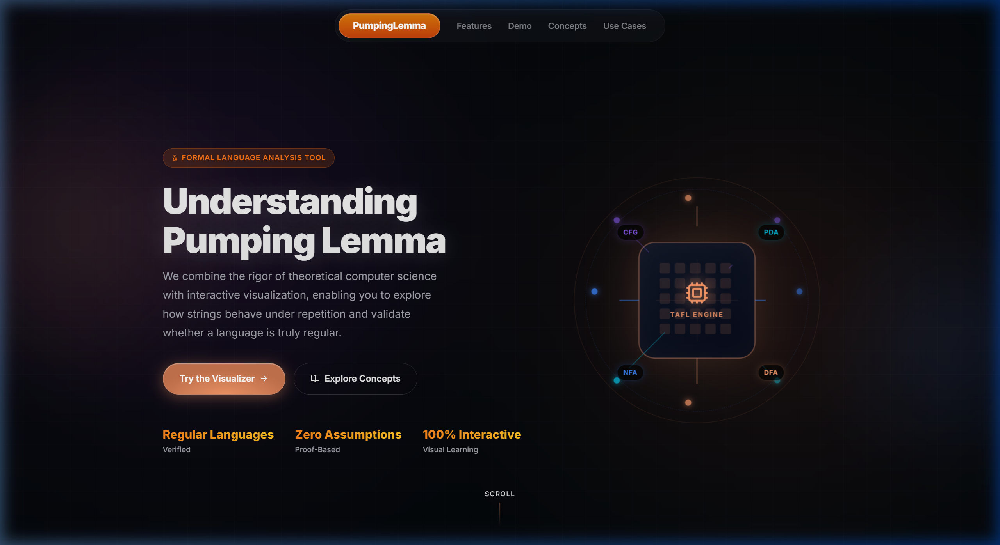
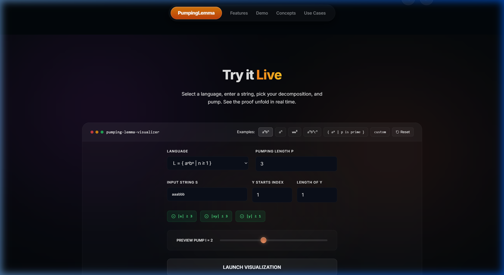
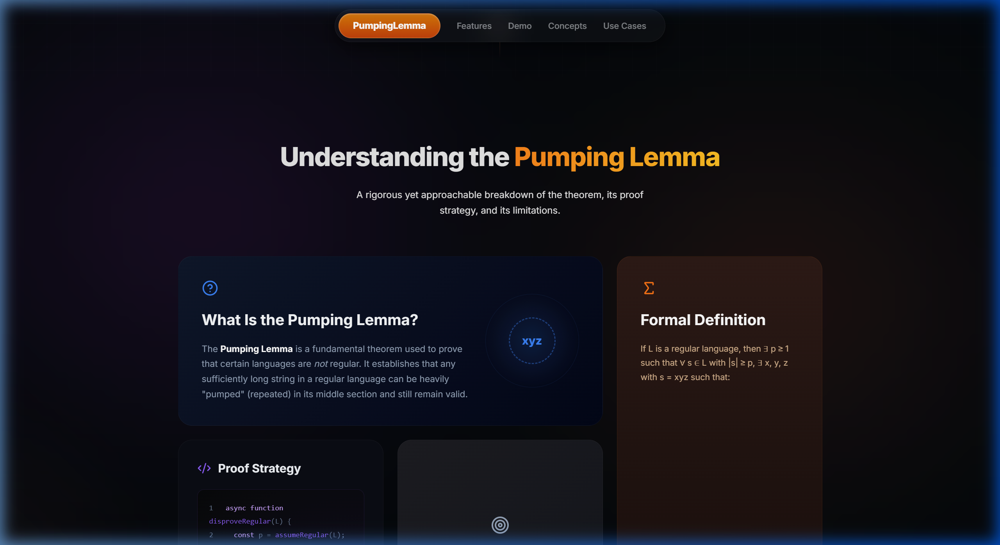

# Pumping Lemma Visualizer 🚀

A high-fidelity, interactive web application designed to demystify the **Pumping Lemma for Regular Languages**. This tool combines theoretical rigor with modern UI/UX to help students and researchers visualize how strings are decomposed and "pumped" to prove or disprove language regularity.



## ✨ Features

- **Interactive Proof Sequencer**: Step through the pumping process manually to see how different values of $i$ affect the string.
- **Adversarial Engine**: Visualizes the "game" between the Prover and the Adversary, making complex logic easier to digest.
- **Real-time Feedback**: Instant validation and visualization of string constraints ($|xy| \le p$, $|y| \ge 1$).
- **Premium UI/UX**: Built with a sleek glassmorphic design, smooth Framer Motion animations, and Lenis smooth scrolling.
- **Language Presets**: Includes classic examples like $a^n b^n$, $w w^R$, $a^p$ (where $p$ is prime), and more.

## 📸 Screenshots

### Interactive Demo Tool


### Concept Visualization


### Use Case Explorer


## 🛠️ Tech Stack

- **Framework**: [React 19](https://react.dev/)
- **Build Tool**: [Vite 8](https://vitejs.dev/)
- **Styling**: [Tailwind CSS 4](https://tailwindcss.com/)
- **Animations**: [Framer Motion](https://www.framer.com/motion/)
- **Icons**: [Lucide React](https://lucide.dev/)
- **Smooth Scrolling**: [Lenis](https://github.com/darkroomengineering/lenis)

## 🚀 Getting Started

### Prerequisites

- Node.js (v18 or higher)
- npm or yarn

### Installation

1. **Clone the repository**
   ```bash
   git clone https://github.com/parth-2905/Pumping-Lemma-Visualizer.git
   cd Pumping-Lemma-Visualizer
   ```

2. **Install dependencies**
   ```bash
   npm install
   ```

3. **Run the development server**
   ```bash
   npm run dev
   ```

4. **Open your browser**
   Navigate to `http://localhost:5173` to see the visualizer in action.

## 📖 How it Works

The Pumping Lemma states that for any regular language $L$, there exists a pumping length $p$. This visualizer helps you explore the three conditions of the lemma:
1. $s = xyz$
2. $|xy| \leq p$
3. $|y| \geq 1$
4. For all $i \geq 0$, $xy^iz \in L$

By interactively adjusting $p$, $s$, and the indices for $x, y, z$, you can see where the conditions fail for non-regular languages.

## 📄 License

This project is open-sourced under the MIT License.

---
Built with ❤️ for the Theory of Automata and Formal Languages.
